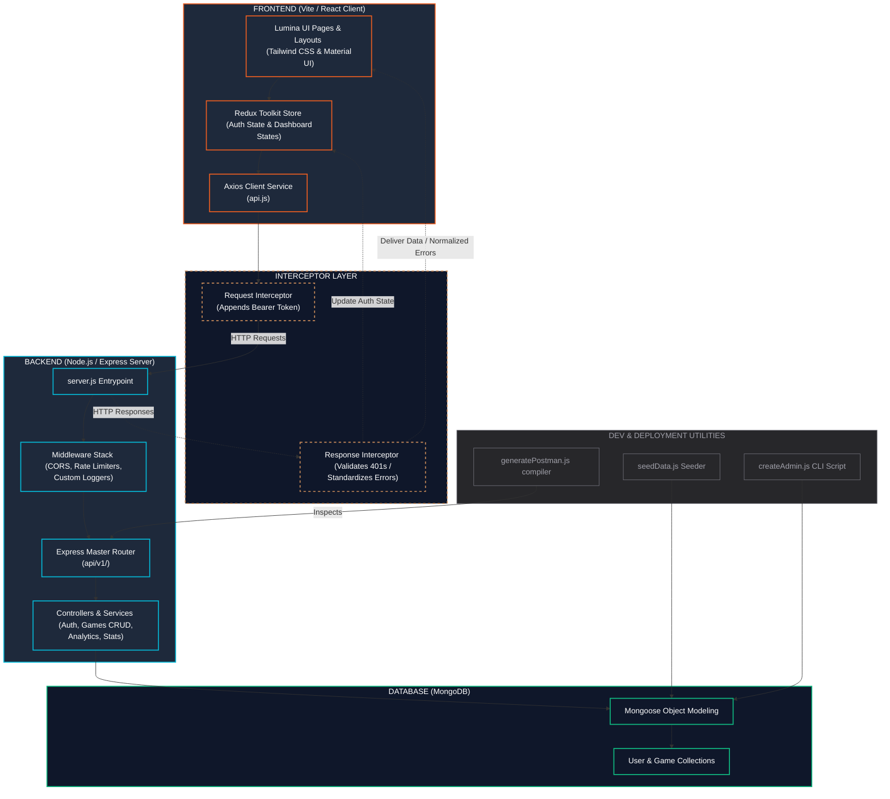

# NEXUS — Full-Stack Steam Games Analytics & Management Dashboard

NEXUS is a beginner-friendly, production-style full-stack web application designed for exploring, curating, and analyzing Steam-style game data. The project couples a powerful **Node.js/Express/MongoDB** backend API with a modern, responsive **Vite/React** frontend dashboard styled after the premium, dark-slate **Lumina** design system.

---

## 🎮 Interactive System Architecture

The following diagram illustrates the data flow, request lifecycle, state management loop, and supporting tools of the NEXUS application:



### Architecture Highlights
1. **Unidirectional UI State Flow**: User interactions invoke actions dispatching to the **Redux Store**, driving the **Axios** client.
2. **Decoupled API Interceptor Layer**: Sits transparently between client and server. Outgoing queries receive authentication tokens automatically, and incoming responses/errors are standardized before reaching UI components.
3. **Robust Backend Middleware Pipeline**: Express uses security filters (CORS, Rate Limiting) and logging mechanisms to pre-process requests before matching endpoints in the **Master Router**.
4. **Self-Documenting Code Base**: The routing hierarchy is scanned directly from the active router stack at compile time, feeding both the browser-accessible Developer Playground and the exported Postman collection.

---

## 📂 Project Directory Structure

```
a_steam_data_souvik_biswas/
├── README.md                               ← This full-stack guide
├── Steam_Games_API.postman_collection.json  ← Generated Postman v2.1.0 collection
├── presentation_script.md                   ← Presentation talking points & guide
│
├── frontend/                               ← Vite + React Application
│   ├── src/
│   │   ├── components/                     ← Reusable UI blocks
│   │   ├── hooks/                          ← Custom React hooks
│   │   ├── layouts/                        ← Dashboard & general wrappers
│   │   ├── pages/                          ← LandingPage, Auth, Dashboard, Registry
│   │   ├── routes/                         ← Protected & public route guards
│   │   ├── services/                       ← Axios API client with interceptors
│   │   ├── store/                          ← Redux store configurations
│   │   ├── App.jsx & main.jsx
│   │   └── index.css                       ← Core styles & theme configurations
│   ├── package.json
│   ├── vite.config.js
│   └── .env.development                    ← Frontend local environment config
│
└── backend/                                ← Express Backend Server
    ├── server.js                           ← Entry point (starts the server)
    ├── data/
    │   └── sample-games.json               ← Seed dataset
    ├── src/
    │   ├── config/                         ← DB configurations & spec catalogs
    │   ├── models/                         ← User & Game Schemas
    │   ├── controllers/                    ← Express request handlers
    │   ├── services/                       ← Database/Mongoose queries
    │   ├── middlewares/                    ← Error handler, rate limiters, auth guards
    │   ├── utils/                          ← Route scanner, response formatting
    │   └── scripts/
    │       ├── seedData.js                 ← Seeder script for game data
    │       ├── createAdmin.js              ← CLI script to seed administrator accounts
    │       └── generatePostman.js          ← Dynamic Postman generator script
    └── package.json
```

---

## ⚡ Setup & Installation

### Prerequisites
* **Node.js** (v18+)
* **MongoDB** (Local database instance or a cloud-hosted MongoDB Atlas URI)

---

### Step 1: Configure & Start the Backend

1. **Navigate to the Backend Directory & Install Dependencies:**
   ```bash
   cd backend
   npm install
   ```

2. **Configure Environment Variables:**
   Create a `.env` file in the `backend/` directory:
   ```env
   PORT=5000
   MONGO_URI=mongodb+srv://<username>:<password>@cluster.mongodb.net/steam_games_db?retryWrites=true&w=majority
   JWT_SECRET=your_super_secret_key_change_this_in_production
   JWT_EXPIRES_IN=7d
   NODE_ENV=development
   ```

3. **Seed Game Data:**
   Load the default catalog into your MongoDB database:
   ```bash
   npm run seed
   ```
   *(To seed a custom dataset file, run `node src/scripts/seedData.js "C:/path/to/custom-games.json"`)*

4. **Create a Test Administrator Account:**
   Seed a verified admin user (`admin@example.com` / `adminpassword123`):
   ```bash
   node src/scripts/createAdmin.js
   ```

5. **Start the API Server:**
   * **Development Mode (Auto-restart on save):**
     ```bash
     npm run dev
     ```
   * **Production Mode:**
     ```bash
     npm start
     ```
   Expect output confirming a successful MongoDB connection and the server listening on Port 5000.

---

### Step 2: Configure & Start the Frontend

1. **Navigate to the Frontend Directory & Install Dependencies:**
   ```bash
   cd ../frontend
   npm install
   ```

2. **Configure Environment Variables:**
   A `.env.development` file is provided, directing Axios queries to the backend:
   ```env
   VITE_API_URL=http://localhost:5000
   ```

3. **Launch the Development Server:**
   ```bash
   npm run dev
   ```
   This boots the Vite application (typically on `http://localhost:5173`). Open the browser to explore.

---

## 🛠️ Essential Automation Scripts

### Admin Seeding (`createAdmin.js`)
Administrators have access to exclusive routes (game creation, editing, deleting, database monitoring). Run this script to generate a clean admin user directly:
```bash
node backend/src/scripts/createAdmin.js
```

### Dynamic Postman Collection Generation (`generatePostman.js`)
To prevent documentation from drifting when routing specs change, run:
```bash
node backend/src/scripts/generatePostman.js
```
This script inspects all active express endpoints at runtime and exports an updated `Steam_Games_API.postman_collection.json` file to the project root, ready to import.

---

## 🔒 API Endpoints & Playground

Base URL: `http://localhost:5000`

* **Auth Routes (`/api/v1/auth/*`)**: Register, login, change passwords, and fetch authenticated profiles.
* **Games Directory (`/api/v1/games/*`)**: 
  - CRUD operations (`POST`, `PUT`, `DELETE` are protected behind administrator guards).
  - Review operations (authenticated users can write, update, or remove reviews).
  - Multi-parameter filtering (genres, price, rating, year, downloads, discounts).
* **Analytics (`/api/v1/analytics/games/*`)**: Revenue analysis, platform distributions, genre count metrics, and release volume charts.
* **Live API Playground**: Open `http://localhost:5000` in the browser to view the dynamic documentation. You can test public `GET` endpoints with click-to-open links containing mock query parameters.

---

## 🚀 Recent Modifications

1. **Axios Centralization**: Refactored the frontend's networking in `api.js` to run on a central axios instance equipped with automatic token injection interceptors.
2. **Admin Auto-Creation**: Introduced the `createAdmin.js` script to instantly provision accounts with access levels above standard users.
3. **Auto-Documenter**: Created the Postman generation pipeline, mapping code routes directly to importable REST requests.
